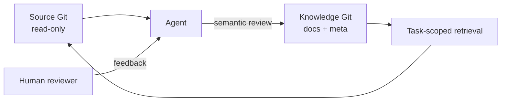

# llmdoc

[Website](https://llmdoc.tokenroll.ai/) · [简体中文](README.zh-CN.md)

**Detached Engineering Knowledge Base.** llmdoc keeps a durable engineering
knowledge base maintained by agents with human review, independent of the
source-code lifecycle. Source Git commits define facts; Knowledge Git commits
preserve verified understanding of those facts.

## Design principles

1. **Separate facts from understanding.** Source commits are the traceable factual
   baseline; Knowledge commits preserve the engineering understanding that agents
   formed and verified against that baseline. Source answers "what the system is
   now"; llmdoc answers "why it is designed this way, which constraints must hold,
   and what future changes need to know."
2. **Keep one durable write boundary.** Source Git stays read-only: llmdoc never
   modifies, stages, or commits the business repository. All durable knowledge and
   its metadata live and evolve only in an independent Knowledge Git, and llmdoc
   never falls back to the source Git when that Knowledge Git is missing.
3. **Record only durable engineering knowledge.** Only knowledge with future
   decision value, high reconstruction cost, and stability across multiple source
   commits enters the formal knowledge base: architectural intent, design decisions,
   constraints, invariants, failure semantics, and cross-module contracts. File
   structure, symbol relations, call graphs, and similar source-rebuildable
   information belong in indexes or caches, not durable knowledge.
4. **Treat source change as a review obligation.** A source change means related
   knowledge must be re-verified, not that the prose must change. Semantic review has
   three outcomes: update the prose, keep the prose and refresh the validation
   baseline, or confirm the change is irrelevant. llmdoc never turns a source diff
   into an automatic knowledge changelog.
5. **Make knowledge validity verifiable.** Every formal document declares its source
   scope, validated source revision, and the content-integrity information needed to
   distinguish `current`, `needs_review`, and `unverified` states. Retrieval
   returns content together with its validation evidence instead of relying on
   document update times.
6. **Agents maintain knowledge; humans review conclusions.** Agents drive discovery,
   organization, editing, verification, and sealing. Humans can review agent
   conclusions and raise corrections, additions, or challenges; that feedback
   re-enters the agent's update flow, and llmdoc performs the formal edit and
   re-verification. Human review is an optional quality-control step, not a
   precondition for routine knowledge maintenance.
7. **Keep knowledge separate from execution instructions.** llmdoc preserves
   readable, searchable, citable, and auditable reference knowledge. It does not
   distribute rules, skills, prompts, hooks, or other execution instructions, and no
   knowledge content may depend on hidden instructions or runtime behavior to hold.

## The dual-repository model



One Source Git worktree is bound to one independent Knowledge Git worktree. The
Knowledge Git is the only persistent write boundary. The CLI reads the source
with optional index writes disabled, never modifies source files, index, or
history, and never falls back to writing knowledge into the source repository.
The association is recorded in a user-level registry, not inside the source.

## Eight hard boundaries

1. **Read-only source.** The knowledge workflow never modifies the source
   repository's files, index, history, or configuration. Source development is a
   separate workflow.
2. **Independent knowledge Git.** The Knowledge Repository must be its own Git
   repository. It is external by default; a nested independent Git is supported
   only when explicitly selected.
3. **No upward fallback.** Persistent knowledge writes never fall back to the
   source Git. With no binding or no independent Git, the CLI fails explicitly.
   Read-only retrieval may read an explicitly named no-Git knowledge directory.
4. **Valid, clean committed source snapshot.** Only a source commit with a valid
   HEAD and a fully clean worktree/index counts. The source revision is the
   validation basis; the knowledge revision is the Knowledge Git commit.
5. **Review Manifest with a temporary index and CAS.** A Review Manifest binds
   the source revision, content digests, and scope. Bodies, relations, and meta
   are published in one step through a temporary index and a compare-and-swap ref
   update; the knowledge index must have nothing staged, and it is synchronized
   on success together with llmdoc-owned generated files.
6. **Agents own semantic maintenance.** Agents edit, verify, and seal formal
   knowledge; humans review conclusions and return corrections to that workflow.
   The CLI performs deterministic structure, scope, and commit checks. A passing
   `validate` does not prove that the knowledge is correct.
7. **Rebuildable indexes.** AST, symbol, and dependency graphs are rebuildable
   indexes, not a committable code encyclopedia.
8. **Reviewable standard Markdown.** Agents maintain formal knowledge through the
   guarded validation and commit protocol. Humans review the same plain Markdown
   and feed corrections back through the Agent workflow. Knowledge is reference
   data, not executable rules or skills.

The "only write boundary" means the knowledge content and its Git. `bind` may
write a user-level registry, and temporary files and caches are written under the
knowledge directory or a user-level cache. Those are explicit exceptions, and
none of them may write into the source repository. Nested mode only writes the
independent knowledge subtree; it never changes the outer Git, ignore rules, or
other source files. If the source directory must remain byte-for-byte unchanged,
use external mode.

## Install

### Claude Code

Add the marketplace and install the plugin:

```text
/plugin marketplace add TokenRollAI/llmdoc
/plugin install llmdoc@llmdoc-plugin
```

If the install summary says `Run /reload-plugins to activate.`, run that command.
If the reload warns about rereading the conversation, rerun it as
`/reload-plugins --force`. Once the plugin is active, initialize a repository
with `/llmdoc:init`.

### Codex

Add the marketplace and start Codex from the repository:

```bash
codex plugin marketplace add TokenRollAI/llmdoc
codex
```

Inside Codex, run `/plugins`, open the `llmdoc-plugin` marketplace, and install
`llmdoc`. Review the plugin and its hooks before enabling them, then ask a new
session to use the `llmdoc:init` skill.

### Direct CLI

No plugin is required. Run the external CLI from the repository you want to work
on:

```bash
npx -y @tokenroll/llmdoc --help
npx -y @tokenroll/llmdoc tree --source .
```

`@tokenroll/llmdoc` is external tooling. Do not add it to the consumer project's
`package.json` or lockfile, and never use the unrelated bare package name
`npx llmdoc`. For reproducible runs, pin the package spec:
`npx -y @tokenroll/llmdoc@<version> <command>`.

## Knowledge layout

```text
knowledge/
├── .git/
├── llmdoc.yaml            # shared identity and layout version
├── README.md              # machine-generated navigation region
├── docs/
│   ├── architecture.md
│   └── lifecycle/task-recovery.md
├── inbox/                 # unverified candidates
├── .llmdoc/meta.json      # per-document validation evidence
└── .llmdoc-cache/         # rebuildable, excluded by the knowledge .gitignore
```

Document IDs are docs-relative POSIX `.md` paths, and `docs/` may be nested to
any depth. The `README.md` navigation region is generated from titles,
descriptions, and paths, and is never a knowledge node or a validation target.

## Walkthrough

### 1. Create and bind

```bash
# Create an external knowledge repository and bind it to the source
npx -y @tokenroll/llmdoc init --source ./app --knowledge ../app-knowledge

# Or bind an existing independent knowledge repository
npx -y @tokenroll/llmdoc bind --source ./app --knowledge ../app-knowledge
```

`--nested` explicitly places the knowledge repository inside the source worktree;
use it only when the outer Git does not track that subtree. `init` never
overwrites a non-empty target and never modifies the source.

### 2. Retrieve

```bash
npx -y @tokenroll/llmdoc tree                       # knowledge map (topics and root docs)
npx -y @tokenroll/llmdoc index --topic lifecycle    # metadata without bodies
npx -y @tokenroll/llmdoc search "retry policy"      # lexical search
npx -y @tokenroll/llmdoc context --files src/api/client.ts
npx -y @tokenroll/llmdoc show lifecycle/task-recovery.md
```

These entry points are alternatives, not a fixed sequence. `status` and `delta`
report review obligations and source blockers; they are not retrieval steps.

### 3. Capture a candidate

```bash
npx -y @tokenroll/llmdoc capture --title "lease vs timeout" \
  --note "observed during incident review" --from notes.md
```

`capture` writes only `inbox/`. It never touches `docs/`, meta, the navigation
README, or the source repository, carries no verification trailer, and does not
require a clean source worktree. Formal retrieval never returns candidates.

### 4. Update: review candidates

```bash
npx -y @tokenroll/llmdoc update --promote inbox/lease-vs-timeout.md \
  --to lifecycle/task-recovery.md --kind decision \
  --description "Why task recovery joins lease and timeout checks." \
  --source-path "internal/task/**" --requires lifecycle/architecture.md
```

`update` applies explicit `--promote` / `--reject` decisions to the knowledge
worktree and forms an unconfirmed Review Manifest. It never marks anything
current; publication still requires confirmation and a commit.

### 5. Review and confirm

```bash
npx -y @tokenroll/llmdoc review
npx -y @tokenroll/llmdoc review --confirm <reviewId> --set lifecycle/task-recovery.md=unchanged
```

`review` requires a valid, fully clean source snapshot and generates a temporary
Review Manifest that binds the fixed source revision, each document digest and
scope, and the write set. A human or agent then confirms the semantic conclusion
for each item: `changed`, `unchanged`, or `insufficient`. Any edit after
confirmation invalidates the manifest.

### 6. Commit (seal)

```bash
npx -y @tokenroll/llmdoc commit --review <reviewId>
```

`commit` consumes a confirmed manifest and seals the write set into one knowledge
commit. There is no bare verified flag. Knowledge staging, a dirty or invalid
source snapshot, and any content drift invalidate the manifest.

### 7. Prune

```bash
npx -y @tokenroll/llmdoc prune --report
npx -y @tokenroll/llmdoc prune --remove decisions/old.md
```

`prune --report` lists conservative convergence candidates. `prune --remove`
removes eligible documents, repairs every inbound relation and link, and forms an
unconfirmed Review Manifest to publish with `commit --review`. Fragment-only
candidates are conservatively retained.

### 8. Migrate legacy V3

```bash
npx -y @tokenroll/llmdoc migrate --dry-run --knowledge ../app-knowledge
npx -y @tokenroll/llmdoc migrate --knowledge ../app-knowledge
```

`migrate` is the only command that reads the legacy V3 layout (`.mdx`, `CodeRef`,
`code.paths`, `llmdoc/meta.json`, and `llmdoc.config.json`). It copies
losslessly convertible documents into a new independent knowledge Git, creates a
new migration baseline without extracting old history, never modifies the legacy
repository or the source worktree, and writes the user binding only after the
target fully validates.

### 9. Hooks and viewer

```bash
npx -y @tokenroll/llmdoc hook session-start
npx -y @tokenroll/llmdoc serve
```

`hook session-start | stop | compact` is read-only and fail-open: it reports
review obligations and source blockers, never writes source or knowledge, and
never initializes a binding. `serve` starts a read-only viewer of the fixed
Knowledge HEAD with the same tri-state and double revision as the CLI.

## Front matter and source evidence

Every formal document requires a non-empty `source.paths` list of repo-relative
globs. Absolute paths and `..` are rejected, and each concrete path must exist in
the specified snapshot.

```yaml
---
kind: decision
description: Why task recovery joins lease and timeout to decide owner expiry.
source:
  paths:
    - internal/task/**
    - pkg/lease/**
relations:
  requires:
    - lifecycle/architecture.md
  supersedes:
    - decisions/old-recovery.md
---
```

`kind` is one of `architecture`, `decision`, `guide`, or `reference`. `relations`
supports `requires`, `related`, and `supersedes`. `supersedes` points from a new
decision to the older one it replaces; it does not change either document's
validation state. `requires` forms an acyclic dependency graph: when an upstream
document changes and is re-sealed, its dependents become `needs_review` until
they are re-verified against the new digest.

## Validity: double revision and tri-state

`.llmdoc/meta.json` (schema `llmdoc.meta/v3-ng`) stores per-document validation
evidence. Unverified documents use `null/null/[]/{}`:

```json
{
  "schema": "llmdoc.meta/v3-ng",
  "source": {
    "repositoryId": "project-id",
    "lastGlobalReviewRevision": "<full-source-commit-oid>"
  },
  "documents": {
    "lifecycle/task-recovery.md": {
      "validatedSourceRevision": "<full-source-commit-oid>",
      "validatedContentDigest": "sha256:<hex>",
      "validatedSourcePaths": ["internal/task/**", "pkg/lease/**"],
      "validatedRequires": {
        "lifecycle/architecture.md": "sha256:<dependency-hex>"
      }
    }
  }
}
```

The four `validated*` fields are a snapshot of the evidence at seal time: the
source revision, the document digest, the source evidence scope, and the upstream
knowledge digests. The digest covers the whole normalized UTF-8 document,
including front matter, scope, relations, and body.

A document status is only one of:

| Status | Meaning |
|---|---|
| `unverified` | No validation declaration; not current fact. |
| `current` | The digest matches, the validated revision is still explainable, and every `requires` target is current with the recorded digest. |
| `needs_review` | Related source, knowledge prose, or a relation changed and needs semantic review. |

Source blockers are reported separately from document status: `unbound`,
`invalid_head`, `source_dirty`, `history_unavailable`, and `diverged`. Formal
update, review, and seal require a valid source HEAD and a fully clean source
worktree/index. If the source is not yet committed you can still retrieve
existing knowledge or capture candidates, but you cannot formally re-verify or
seal.

## Command reference

Run `npx -y @tokenroll/llmdoc --help` or
`npx -y @tokenroll/llmdoc help <command>` for the current CLI reference. All
retrieval commands support `--json`, `--budget`, and `--limit`; `--cursor`
continues truncated output.

| Command | Purpose |
|---|---|
| `bind --source <dir> --knowledge <dir> [--nested]` | Associate a source repository with an independent knowledge repository. |
| `init --source <dir> --knowledge <dir> [--nested]` | Create a new independent knowledge repository and bind it. |
| `tree` | Knowledge map by topic. |
| `index [--topic] [--kind]` | Document metadata without bodies. |
| `show <path...>` | Read selected document bodies. |
| `search <query>` | Lexical search with Chinese segmentation and a CJK-bigram fallback. |
| `context --files <files...>` | Map source files to documents, including the `requires` closure. |
| `validate` | Deterministic front matter, link, relation, source-scope, and schema checks. |
| `status` | Source blockers, knowledge state, and review obligations. |
| `delta [--scope <id...>]` | Documents needing semantic review after source or knowledge changes. |
| `review [--confirm <reviewId>] [--set <id>=<conclusion>...] [--global]` | Generate or confirm a Review Manifest. |
| `commit --review <reviewId>` | Seal a confirmed manifest into one knowledge commit. |
| `capture [--title] [--note] [--from] [--body] [--source-revision]` | Persist an unverified candidate under `inbox/`. |
| `update [--promote ...] [--reject ...] [--prepare] [--global]` | Review candidates and form an unconfirmed manifest. |
| `prune [--report] [--remove <id...>] [--global]` | Report convergence candidates or prepare eligible removals. |
| `migrate --knowledge <dir> [--source] [--legacy] [--dry-run] [--nested]` | Explicitly migrate a legacy V3 layout into a new independent knowledge repository. |
| `hook <session-start\|stop\|compact>` | Read-only, fail-open host diagnostics. |
| `serve [--port]` | Read-only viewer of the fixed Knowledge HEAD on `127.0.0.1`. |

## Platform integration

- **Claude Code:** the repository-root plugin provides the operating skill, the
  workflows, roles, and lifecycle hooks. See the
  [Claude Code plugin documentation](https://code.claude.com/docs/en/discover-plugins).
- **Codex:** the Codex plugin exposes equivalent skills, roles, and hooks. See
  the [official Codex plugin documentation](https://developers.openai.com/codex/plugins).
- **Other agents:** use the portable
  [`AGENTS.md` integration recipe](docs/agent-integration.md) and the same
  external CLI.

All fixed CLI interface text is English, including help, diagnostics, hook
messages, and the local viewer. Chinese queries and repository document content
remain fully supported and are returned unchanged.

## Develop this repository

The repository root is a private development workspace; the public consumer
artifact is the `@tokenroll/llmdoc` CLI.

```bash
npm install
npm run typecheck
npm run lint
npm test
npm run test:integration
npm run build
npm run validate:dogfood
npm run check:prompts
```

`npm test` is the quick development gate: protocol contracts, host surfaces,
selected read paths, and one real review/seal smoke transaction. Run
`npm run test:integration` for the complete dual-Git, CAS, lock, migration,
rollback, and fault-injection suite; CI runs it once on Node 22 while the quick
gate runs across the supported Node matrix.

Install from the repository root so the local `llmdoc` bin is linked before
validation. CLI semantics changes must stay synchronized with the host surfaces,
the bilingual READMEs, the design documentation, and dogfood knowledge.

## Reference

- [Portable Agent integration recipe](docs/agent-integration.md)
- [architecture and protocol](docs/v3-ng-design/architecture.md)
- [Operating protocol](skills/llmdoc/SKILL.md)
- Workflow contracts: [`init`](skills/init/SKILL.md),
  [`update`](skills/update/SKILL.md), [`prune`](skills/prune/SKILL.md), and
  [`migrate`](skills/migrate/SKILL.md)
- Runtime reference: `npx -y @tokenroll/llmdoc --help`
