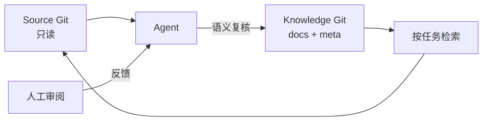

# llmdoc

[官网](https://llmdoc.tokenroll.ai/) · [English](README.md)

**Detached Engineering Knowledge Base（独立工程知识库）。** llmdoc 维护一份由
Agent 维护、人工审阅且独立于源码生命周期的持久工程知识库。Source Git 的 commit 定义事实；
Knowledge Git 的 commit 保存对这些事实经过验证的理解。

## 设计原则

1. **事实与理解分离。** Source commit 是可追溯的事实基线；Knowledge commit 保存
   Agent 针对该事实基线形成并验证过的工程理解。源码回答“系统现在是什么”，llmdoc
   回答“为什么这样设计、哪些约束必须成立，以及未来修改时需要知道什么”。
2. **只有一个持久写入边界。** Source Git 对 llmdoc 始终只读；llmdoc 不得修改、
   stage 或 commit 业务仓。所有持久知识及其元数据只在独立的 Knowledge Git 中保存和
   演进，且不得在 Knowledge Git 缺失时退回 Source Git。
3. **只沉淀长期工程知识。** 只有同时具备未来决策价值、较高重建成本和跨多个 source
   commit 稳定性的知识才进入正式知识库，包括架构意图、设计决策、约束、不变量、失败
   语义和跨模块契约。文件结构、符号关系、调用图等可从源码重新生成的信息属于索引或
   缓存，而不是持久知识。
4. **源码变化只产生复核义务。** 代码变化意味着相关知识需要重新验证，而不意味着文档
   必须变化。语义复核可以得到三种结果：正文需要更新、正文不变但刷新验证基线，或确认
   变化与该知识无关。llmdoc 不根据代码 diff 自动生成知识变更日志。
5. **知识有效性必须可验证。** 每份正式知识都应声明其 source scope、validated
   source revision 和必要的内容完整性信息，使 llmdoc 能明确区分 `current`、
   `needs_review`、`unverified` 三种状态。检索结果应同时返回知识内容和验证依据，
   而不是仅依赖文档更新时间判断可信度。
6. **Agent 维护知识，人负责审阅结论。** 知识的发现、整理、修改、验证和 seal 由
   Agent 驱动。人可以审阅 Agent 生成的结论并提出纠正、补充或质疑；这些反馈重新进入
   Agent 的知识更新流程，由 llmdoc 完成正式知识的修改和重新验证。人工审阅是可选的质量
   控制环节，而不是日常知识维护的前置条件。
7. **知识与执行指令分离。** llmdoc 保存的是可阅读、可检索、可引用和可审计的
   reference knowledge，不承担 rule、skill、prompt、hook 或其他执行指令的分发职责。
   知识内容不得依赖隐藏指令或运行时行为才能成立。

## 双仓库模型



一个 Source Git worktree 绑定到一个独立的 Knowledge Git worktree。Knowledge Git
是唯一的持久写入边界。CLI 读取源码时禁用可选 index 写入，绝不修改源码文件、
index 或 history，也绝不会把知识回退写入源码仓库。绑定关系记录在用户级 registry，
而不是源码仓库内部。

## 八条硬边界

1. **源码只读。** 知识工作流绝不修改源码仓库的文件、index、history 或配置。源码
   开发是另一条工作流。
2. **独立 Knowledge Git。** Knowledge Repository 必须是自己的 Git 仓库。默认外置；
   嵌套独立 Git 仅在显式选择时支持。
3. **禁止向上回退。** 持久知识写入绝不回退到 Source Git。没有绑定或没有独立 Git
   时 CLI 明确失败。只读检索可以读取显式指定的无 Git 知识目录。
4. **有效且 clean 的已提交 source 快照。** 只有 HEAD 有效且 worktree/index 全仓
   clean 的 source commit 才算数。Source revision 是验证依据，Knowledge revision
   是 Knowledge Git commit。
5. **Review Manifest 搭配临时 index 与 CAS。** Review Manifest 绑定 source
   revision、内容 digest 与 scope。正文、关系与 meta 通过临时 index 和 ref 的
   compare-and-swap 一次发布；知识 index 不得有任何 staged 内容，成功后与
   llmdoc 自有生成文件一起同步。
6. **Agent 负责语义维护。** 正式知识由 Agent 修改、验证和 seal；人审阅结论并把纠正
   反馈给 Agent 流程。CLI 执行确定性的结构、范围与提交检查，`validate` 通过并不证明
   知识正确。
7. **可重建索引。** AST、符号与依赖图是可重建索引，不是可提交的代码百科。
8. **使用可审阅的标准 Markdown。** Agent 通过受保护的验证与提交协议维护正式知识；
   人审阅同一份纯 Markdown，并把纠正反馈给 Agent 流程。知识是 reference data，
   不是可执行 rules/skills。

“唯一写入边界”指知识内容及其 Git。`bind` 可以写用户级 registry，临时文件和缓存
写在知识目录或用户级缓存下。这些都是明确例外，且都不能写入源码仓库。嵌套模式只写
独立知识子树，绝不改动外层 Git、ignore 规则或其他源码文件。若要求源码目录字节级
完全不变，请使用外置模式。

## 安装

### Claude Code

添加 marketplace 并安装插件：

```text
/plugin marketplace add TokenRollAI/llmdoc
/plugin install llmdoc@llmdoc-plugin
```

如果安装摘要提示 `Run /reload-plugins to activate.`，请运行该命令；如果 reload
警告需要重新读取对话，请改用 `/reload-plugins --force`。插件生效后，用
`/llmdoc:init` 初始化仓库。

### Codex

添加 marketplace，然后从仓库目录启动 Codex：

```bash
codex plugin marketplace add TokenRollAI/llmdoc
codex
```

在 Codex 中运行 `/plugins`，打开 `llmdoc-plugin` marketplace 并安装 `llmdoc`。
启用前先审查插件及其 hooks，然后在新会话中要求使用 `llmdoc:init` skill。

### 直接使用 CLI

不需要插件。在你需要工作的仓库中运行外部 CLI：

```bash
npx -y @tokenroll/llmdoc --help
npx -y @tokenroll/llmdoc tree --source .
```

`@tokenroll/llmdoc` 是项目外部工具。不要把它加入消费项目的 `package.json` 或
lockfile，也不要使用会解析到无关第三方包的裸命令 `npx llmdoc`。需要可复现运行时，
请在包名中固定版本：`npx -y @tokenroll/llmdoc@<version> <command>`。

## 知识布局

```text
knowledge/
├── .git/
├── llmdoc.yaml            # 共享身份与布局版本
├── README.md              # 机器生成的导航区
├── docs/
│   ├── architecture.md
│   └── lifecycle/task-recovery.md
├── inbox/                 # 未验证候选
├── .llmdoc/meta.json      # 每篇文档的验证证据
└── .llmdoc-cache/         # 可重建，由知识仓 .gitignore 排除
```

文档 ID 是相对 docs 的 POSIX `.md` 路径，`docs/` 可以任意层级嵌套。`README.md`
的导航区由标题、description 和路径生成，永远不是知识节点，也不是验证对象。

## 操作走查

### 1. 创建与绑定

```bash
# 创建外置知识仓并绑定到源码
npx -y @tokenroll/llmdoc init --source ./app --knowledge ../app-knowledge

# 或绑定已有的独立知识仓
npx -y @tokenroll/llmdoc bind --source ./app --knowledge ../app-knowledge
```

`--nested` 显式把知识仓放进源码 worktree 内；只有外层 Git 未跟踪该子树时才使用。
`init` 绝不覆盖非空目标，也绝不修改源码。

### 2. 检索

```bash
npx -y @tokenroll/llmdoc tree                       # 知识地图（topic 与根文档）
npx -y @tokenroll/llmdoc index --topic lifecycle    # 不含正文的元数据
npx -y @tokenroll/llmdoc search "重试策略"          # 词法搜索
npx -y @tokenroll/llmdoc context --files src/api/client.ts
npx -y @tokenroll/llmdoc show lifecycle/task-recovery.md
```

这些入口是备选关系，不是固定步骤。`status` 与 `delta` 报告复核义务和源码阻断原因，
不是检索步骤。

### 3. 捕获候选

```bash
npx -y @tokenroll/llmdoc capture --title "lease vs timeout" \
  --note "incident review 时观察到" --from notes.md
```

`capture` 只写 `inbox/`，绝不触碰 `docs/`、meta、导航 README 或源码仓库，不带验证
trailer，也不要求源码 worktree clean。正式检索永不返回候选。

### 4. 更新：复核候选

```bash
npx -y @tokenroll/llmdoc update --promote inbox/lease-vs-timeout.md \
  --to lifecycle/task-recovery.md --kind decision \
  --description "任务恢复为什么联合 lease 与 timeout 判断 owner 失效。" \
  --source-path "internal/task/**" --requires lifecycle/architecture.md
```

`update` 把显式的 `--promote` / `--reject` 决定应用到知识 worktree，并形成一个未
确认的 Review Manifest。它绝不把任何文档标为 current；发布仍需确认和提交。

### 5. 复核与确认

```bash
npx -y @tokenroll/llmdoc review
npx -y @tokenroll/llmdoc review --confirm <reviewId> --set lifecycle/task-recovery.md=unchanged
```

`review` 要求有效且全仓 clean 的 source 快照，并生成临时 Review Manifest，绑定固定
source revision、每篇文档的 digest 与 scope，以及完整写集。随后由 Agent 逐项确认
语义结论：`changed`、`unchanged` 或 `insufficient`。确认之后的任何编辑都会使 manifest
失效。

### 6. 提交（seal）

```bash
npx -y @tokenroll/llmdoc commit --review <reviewId>
```

`commit` 消费已确认的 manifest，把写集 seal 成一次知识提交。不存在裸的 verified
参数。知识 staging、dirty 或无效的 source 快照，以及任何内容漂移，都会使 manifest
失效。

### 7. 收敛

```bash
npx -y @tokenroll/llmdoc prune --report
npx -y @tokenroll/llmdoc prune --remove decisions/old.md
```

`prune --report` 列出保守的收敛候选。`prune --remove` 删除合格文档、修复所有入链与
链接，并形成未确认的 Review Manifest，再用 `commit --review` 发布。仅有碎片证据的
候选会被保守保留。

### 8. 迁移旧 V3

```bash
npx -y @tokenroll/llmdoc migrate --dry-run --knowledge ../app-knowledge
npx -y @tokenroll/llmdoc migrate --knowledge ../app-knowledge
```

`migrate` 是唯一读取旧 V3 布局（`.mdx`、`CodeRef`、`code.paths`、
`llmdoc/meta.json` 与 `llmdoc.config.json`）的命令。它把可无损转换的文档复制到新的
独立 Knowledge Git，建立新的迁移 baseline 而不抽取旧 history，绝不修改旧仓库或源码
worktree，并且只在目标完整校验通过后才写入用户绑定。

### 9. Hooks 与 viewer

```bash
npx -y @tokenroll/llmdoc hook session-start
npx -y @tokenroll/llmdoc serve
```

`hook session-start | stop | compact` 只读且 fail-open：它报告复核义务与源码阻断
原因，绝不写 source 或 knowledge，也绝不初始化绑定。`serve` 启动固定 Knowledge HEAD
的只读 viewer，三态与双 revision 与 CLI 一致。

## Front matter 与源码证据

每篇正式文档都必须声明非空的 `source.paths`（相对 source 根的 glob）。绝对路径与
`..` 会被拒绝，每个具体路径都必须在指定 snapshot 中存在。

```yaml
---
kind: decision
description: 任务恢复为什么联合 lease 与 timeout 判断 owner 失效。
source:
  paths:
    - internal/task/**
    - pkg/lease/**
relations:
  requires:
    - lifecycle/architecture.md
  supersedes:
    - decisions/old-recovery.md
---
```

`kind` 为 `architecture`、`decision`、`guide` 或 `reference`。`relations` 支持
`requires`、`related` 与 `supersedes`。`supersedes` 从新决策指向它替代的旧决策，不
改变任一文档的验证状态。`requires` 构成无环依赖图：上游文档变化并重新 seal 后，其
依赖方会变为 `needs_review`，直到针对新 digest 重新验证。

## 有效性：双 revision 与三态

`.llmdoc/meta.json`（schema `llmdoc.meta/v3-ng`）保存每篇文档的验证证据。未验证文档
使用 `null/null/[]/{}`：

```json
{
  "schema": "llmdoc.meta/v3-ng",
  "source": {
    "repositoryId": "project-id",
    "lastGlobalReviewRevision": "<full-source-commit-oid>"
  },
  "documents": {
    "lifecycle/task-recovery.md": {
      "validatedSourceRevision": "<full-source-commit-oid>",
      "validatedContentDigest": "sha256:<hex>",
      "validatedSourcePaths": ["internal/task/**", "pkg/lease/**"],
      "validatedRequires": {
        "lifecycle/architecture.md": "sha256:<dependency-hex>"
      }
    }
  }
}
```

四个 `validated*` 字段是 seal 时的证据快照：source revision、文档 digest、源码证据
范围与上游知识 digest。digest 覆盖规范化后的完整 UTF-8 文档，包含 front matter、
scope、关系与正文。

文档状态只有三种：

| 状态 | 含义 |
|---|---|
| `unverified` | 没有验证声明；不能当作当前事实。 |
| `current` | digest 匹配、验证 revision 仍可解释，且所有 `requires` 目标 current 且 digest 与记录一致。 |
| `needs_review` | 相关源码、知识正文或关系发生变化，需要语义复核。 |

Source 阻断原因与文档状态分开报告：`unbound`、`invalid_head`、`source_dirty`、
`history_unavailable`、`diverged`。正式 update、review 与 seal 要求有效 source HEAD
且 source worktree/index 全仓 clean。源码尚未提交时可以检索已有知识或 capture 候选，
但不能正式复核或 seal。

## 命令参考

完整且最新的 CLI reference 以 `npx -y @tokenroll/llmdoc --help` 和
`npx -y @tokenroll/llmdoc help <command>` 为准。所有检索命令都支持 `--json`、
`--budget` 与 `--limit`；`--cursor` 用于继续截断的输出。

| 命令 | 用途 |
|---|---|
| `bind --source <dir> --knowledge <dir> [--nested]` | 把源码仓与独立知识仓关联起来。 |
| `init --source <dir> --knowledge <dir> [--nested]` | 创建新的独立知识仓并绑定。 |
| `tree` | 按 topic 展示知识地图。 |
| `index [--topic] [--kind]` | 不含正文的文档元数据。 |
| `show <path...>` | 读取选中的文档正文。 |
| `search <query>` | 词法搜索，含中文分词与 CJK bigram 降级。 |
| `context --files <files...>` | 把源码文件映射到文档，包含 `requires` 闭包。 |
| `validate` | 确定性的 front matter、链接、关系、source scope 与 schema 检查。 |
| `status` | 源码阻断原因、知识状态与复核义务。 |
| `delta [--scope <id...>]` | 源码或知识变化后需要语义复核的文档。 |
| `review [--confirm <reviewId>] [--set <id>=<conclusion>...] [--global]` | 生成或确认 Review Manifest。 |
| `commit --review <reviewId>` | 把已确认的 manifest seal 成一次知识提交。 |
| `capture [--title] [--note] [--from] [--body] [--source-revision]` | 把未验证候选持久化到 `inbox/`。 |
| `update [--promote ...] [--reject ...] [--prepare] [--global]` | 复核候选并形成未确认的 manifest。 |
| `prune [--report] [--remove <id...>] [--global]` | 报告收敛候选或准备合格删除。 |
| `migrate --knowledge <dir> [--source] [--legacy] [--dry-run] [--nested]` | 显式把旧 V3 布局迁移到新的独立知识仓。 |
| `hook <session-start\|stop\|compact>` | 只读、fail-open 的宿主诊断。 |
| `serve [--port]` | 在 `127.0.0.1` 上查看固定 Knowledge HEAD 的只读 viewer。 |

## 平台集成

- **Claude Code：** 仓库根的插件提供 operating skill、工作流、角色与 lifecycle
  hooks。参见
  [Claude Code 插件文档](https://code.claude.com/docs/en/discover-plugins)。
- **Codex：** Codex 插件提供等价的 skills、角色与 hooks。参见
  [OpenAI 官方 Codex 插件文档](https://developers.openai.com/codex/plugins)。
- **其他 Agents：** 使用可移植的
  [`AGENTS.md` 集成配方](docs/agent-integration.md)和同一个外部 CLI。

CLI 自身的固定界面文案全部使用英文，包括 help、诊断、hook message 与本地 viewer。
中文查询与仓库文档正文仍完整支持，并保持原文返回。

## 开发本仓库

仓库根目录是私有开发工作区；面向消费方的公开产物是 `@tokenroll/llmdoc` CLI。

```bash
npm install
npm run typecheck
npm run lint
npm test
npm run test:integration
npm run build
npm run validate:dogfood
npm run check:prompts
```

`npm test` 是日常快速门禁，覆盖协议契约、宿主 surface、选定读取路径和一次真实的
review/seal 冒烟事务。`npm run test:integration` 执行完整双 Git、CAS、锁、迁移、
回滚与故障注入套件；CI 只在 Node 22 完整执行一次，同时在受支持 Node 矩阵运行快速门禁。

请从仓库根目录安装依赖，确保本地 `llmdoc` bin 在校验前已建立链接。CLI 语义变化
必须与两端宿主 surface、双语 README、设计文档和 dogfood knowledge 保持同步。

## 参考

- [可移植 Agent 集成配方](docs/agent-integration.md)
- [架构与协议](docs/v3-ng-design/architecture.md)
- [Operating protocol](skills/llmdoc/SKILL.md)
- Workflow contracts：[`init`](skills/init/SKILL.md)、
  [`update`](skills/update/SKILL.md)、[`prune`](skills/prune/SKILL.md) 和
  [`migrate`](skills/migrate/SKILL.md)
- Runtime reference：`npx -y @tokenroll/llmdoc --help`
